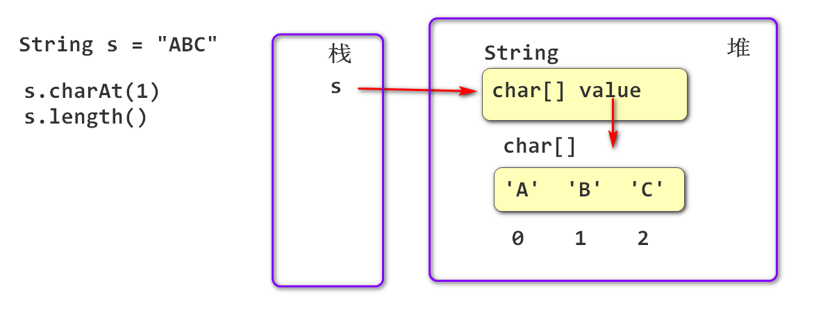
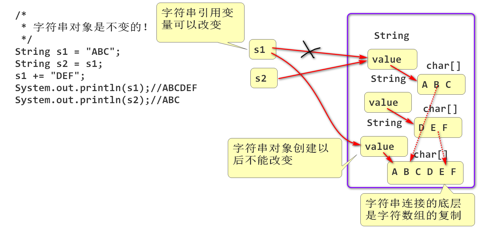
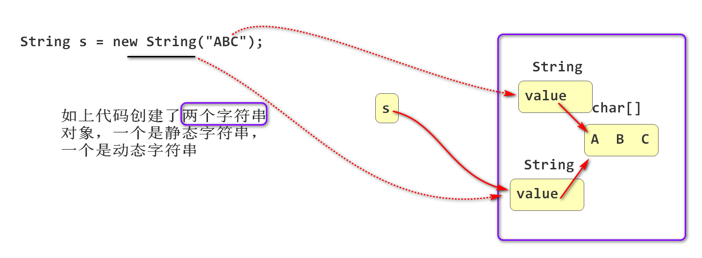
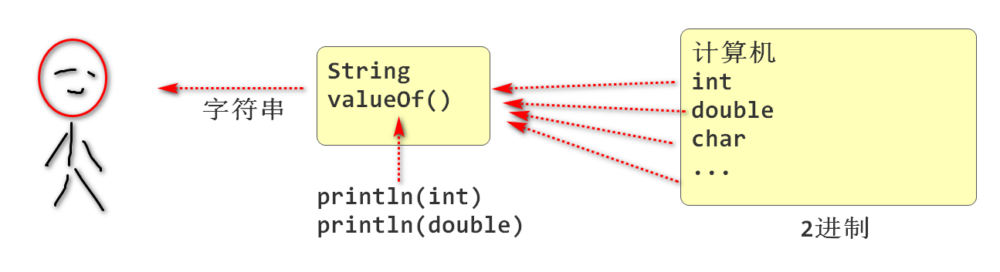
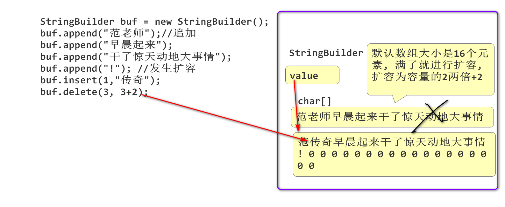

# Java API

## 什么是API

由其他程序员编写的现成的组件以及方法。

当前课程阶段学习Java系统带来的现成的程序组件（API）

## String API

String 在java.lang包中定义。

java.lang是Java的语言包其中定义了Java 语言最核心的API。

String 在Java代表字符串， 任何字符串对象，字符串字面量都是String的实例。

如：

 	String s = "ABC";

"ABC" 相当于:

​	char[] chs = {'A'，'B'，'C'}；

​	String s = new String(chs);

显然 ”ABC“ 更加方便。

```java
public class Demo01 {
    public static void main(String[] args) {
        /*
         * 创建字符串对象
         */
        String s = "ABC";
        char[] chs = {'A','B','C'};
        String s1 = new String(chs);
        /*
         * s 和 s1 基本一样，可以看做“ABC”是
         * new String(chs) 的简化版
         */
        System.out.println(s);
        System.out.println(s1);
    }
}
```

### 字符串内部封装了一个字符数组

字符串内部存储了一个字符数组对象：



Java String 提供了方法可以访问这些字符：

```java
public class Demo01 {
    public static void main(String[] args) {
        /*
         * 创建字符串对象
         */
        String s = "ABC";
        char[] chs = {'A','B','C'};
        String s1 = new String(chs);
        /*
         * s 和 s1 基本一样，可以看做“ABC”是
         * new String(chs) 的简化版
         */
        System.out.println(s);
        System.out.println(s1);
    }
}
```


### 字符串对象不可改变

字符串对象创建以后， 就不能再改变了。

原理：



案例：

```java
package string;

public class Demo03 {
    public static void main(String[] args) {
        /*
         * 字符串对象是不变的！
         */
        String s1 = "ABC";
        String s2 = s1;
        s1 += "DEF";
        System.out.println(s1);//ABCDEF
        System.out.println(s2);
    }
}
```


### 字符串常量池优化

Java 为了提升系统性能， 为了减少字符串对象个数， 提升字符串的复用，利用字符串常量池优化 “静态"字符串

其中静态字符串：

- 字符串字面量， 用双引号 “” 创建的字符串
- 字符串常量  static final 修饰的字符串
- 静态字符串连接的结果： ”ABC“+”DEF” 或者 123+"ABC"

动态字符串：

- 使用new运算创建的字符串
- 字符串变量连接的结果:  s1+s2

```java
package string;

public class Demo04 {
    public static final String S = "ABC";
    public static void main(String[] args) {
        /*
         * 字符串常量池复用 静态字符串
         */
        //java 在第一次创建 静态字符串“ABC”时候，会将其
        //引用存储到字符串常量池中一份
        String s1 = "ABC";
        //第二次遇到 “ABC” 时候就不再创建新对象，而是从
        //常量池中获取原有 “ABC”的引用，赋值给s2
        //也就是说 s1 和 s2 (复用)引用了同一个对象
        String s2 = "ABC";
        //利用s1==s2 检查s1和s2是否引用同一个对象
        System.out.println(s1==s2);//true
        //使用new运算创建的字符串，是动态字符串，不会
        //放到常量池， 不会被复用
        String s3 = new String("ABC");
        System.out.println(s1==s3);

        System.out.println(S==s1);

        String s4 = "AB"+"C"; //编译以后 "ABC"

        String s6 = "AB";
        String s7 = "C";
        String s8 = s6+s7; //编译后 s6+s7 运行期计算
        //运行期间  s6+s7 连接以后会创建新String对象
        //这个对象不会缓存到字符串常量池。
        System.out.println(s1 == s4);//true
        System.out.println(s1 == s8);//false

    }
}
```

经典面试题目:



```java
package string;

public class Demo05 {
    public static void main(String[] args) {
        /*
         * 经典面试题目：
         *  new String("ABC") 创建了几个字符串对象
         * 如果面试时候问:
         *  new String("ABC") 创建了几个对象
         */
        //1. Java首先创建创建静态字符串 "ABC"
        //   这个静态字符串的引用被缓存到了字符串常量池
        //2. 然后利用静态字符串作为参数创建一个
        //   动态字符串 new String(...)
        String s = new String("ABC");

    }
}
```

## Java API 手册

Java 官方提供的Java API 文档.

### toUpperCase() 将字符串转换为大写字符串

- 将字符串中可以转换大写字母转换为大写, 将英文小写转换为大写
- 如果字符串内容有改变, 就返回新字符串.

注意: 需要接收返回值!

```java
public class Demo06 {
    public static void main(String[] args) {
        /*
         * 将字符串转换为大写(UpperCase)
         * - 如果转换以后字符串有改变,就返回一个新字符串
         *   原字符串对象不变
         * 小写(LowerCase)
         */
        String str = "Thinking in Java 是本好书!";
        String s = str.toUpperCase();
        System.out.println(s);
        System.out.println(str);

    }
}
```

### 检查字符串的前缀或者后缀

```java
package string;

public class Demo07 {
    public static void main(String[] args) {
        /*
         * 检查一个字符串后缀情况
         * - 检查文件是否是jpeg照片
         */
        String filename = "demo.jpg";
        //检查文件名是否是 .jpg 后缀的
        if(filename.endsWith(".jpg")){
            System.out.println("这是一个jpeg图片");
        }
    }
}
```

案例2:

```java
package string;

public class Demo08 {
    public static void main(String[] args) {
        /*
         * 如何处理大小写混合问题
         * 将字符串统一转换为大写或者小写,在进行处理
         */
        String filename = "demo.Jpg";
        if(filename.toLowerCase().endsWith(".jpg")){
            System.out.println("这个是照片文件!");
        }
    }
}
```

### trim() 用于去除字符串两端的空白

```java
package string;

public class Demo09 {
    public static void main(String[] args) {
        /*
         * 去除字符串两端的空白
         * - 如果原字符串两端包含空白字符, 就返回
         *   不包含两端空白的新字符串.
         * - 这里的空白包括: 编码小于32的全部控制字符.其中:
         *   - 空格 编码 32
         *   - tab
         *   - 换行等
         * - 经常用于去除用户输入信息中意外输入的空白字符
         */
        String name = "  \t \r \n Tom And Jerry  ";
        String n = name.trim();
        System.out.println(n);//"Tom And Jerry"
        System.out.println(name);
    }
}
```


### 比较字符串相等

引子:

```java
String s1 = "ABC";
String s2 = "ABC";
String s3 = new Stirng("ABC");
System.out.println(s1==s2); //true
System.out.println(s1==s3); //false 
```

如上案例说明: 对于内容一样的字符串, s1, s2 , s3, 显然 == 不能用于判断字符串内容是否一样!

String 类型提供了比较字符串内容是否一致的方法, equals(). 

- 当两个字符串内容完全一样, 比较结果为 true
- 当两个字符串内容不同, 比较结果为false

```java
String s1 = "ABC";
String s2 = "ABC";
String s3 = new Stirng("ABC");
System.out.println(s1.equals(s2)); //true
System.out.println(s1.equals(s3)); //true 
```

### valueOf() Java提供了将其他类型转换为String的方法



```java
package string;

public class Demo11 {
    public static void main(String[] args) {
        /*
         * Java 数据类型在输出之前会调用valueOf方法
         * 将数据转换为 String 类型再输出.
         * valueOf方法是目的是将底层2进制数据转换为
         * 人类熟悉的字符串\10进制, 然后再输出
         */
        int num = 55;
        double d = 3.1415926535897932;
        String s1 = String.valueOf(num);
        String s2 = String.valueOf(d);
        System.out.println(s1);
        System.out.println(s2);
        //println方法的底层会自动调用valueOf方法
        System.out.println(num);
        System.out.println(d);
        //字符串连接期间, 会自动调用valueOf转换数据为
        //字符串类型, 然后再进行字符串的连接
        System.out.println("PI="+d);
    }
}
```

### 截取子字符串

一般情况下将字符串中有意义的一部分截取出来, 称为截取子字符串.

- substring(开始位置, 结束位置) 将字符串从开始位置到结束截取出来作为子字符串
  - substring(开始位置, 开始位置+长度) 
- substring(开始位置) 从开始位置,到字符串末尾全部截取为子字符串

```java
String str = "Thinking in Java 是本好书";
 
String s1 = str.substring(9,11); //in, 包含开始,不包含结束
String s2 = str.substring(9,9+2);//in, 从9开始,连续截取两个字符
String s3 = str.substring(4,4+4);
String s3 = str.substring(4,8);
String s4 = str.substring(12);//"Java 是本好书"
```

### indexOf 检索子字符串的位置

- str.indexOf("Java") 检索str中哪个位置出现了 Java,
  -  返回0以上数字就找了Java, 返回值是一个字符出现的位置
  - 匹配到第一个出现位置就结束
  - 返回-1表示没有找到
- str.indexOf(字符) 检索str中哪个位置出现了 指定字符

例子：

```java
String str = "Thinking in Java 是本好书";
//            01234567890123456789
//如上字符串中包含 Java 吗? 它在那个位置出现的
int index = str.indexOf("Java"); //12
index = str.indexOf("in"); //2
index = str.indexOf('i'); //2
index = str.indexOf("java");//-1
```

indexOf提供了重载的方法, 这些方法可以从指定位置开始查找子字符串:

- str.indexOf(子字符串, 开始位置)
- str.indexOf(字符, 开始位置)

```java
String str = "Thinking in Java 是本好书";
//            01234567890123456789
int index = str.indexOf("in", 3); //5
index = str.indexOf("in", 6);//9
```

### lastIndexOf 

从后向前查找字符串出现的位置:

```java
String str = "Thinking in Java 是本好书";
//            01234567890123456789
int index = str.lastIndexOf("in"); //9
index = str.lastIndexOf("a"); //15
```

## StringBuilder

String 类型是不可变字符串, 操作时候字符串对象不可改变, 如果发生了改变就创建字符串副本. 性能不是很好!

StringBuilder 是可变字符串, 其内部封装了一个字符数组, 其API操作可以改变字符数组的内容, 因为是直接改变了同一个字符数组, 没有发生数组的复制, 所以其修改性能非常好!



```java
public class Demo13 {
    public static void main(String[] args) {
        StringBuilder buf = new StringBuilder();
        buf.append("范老师")//追加
                .append("早晨起来")
                .append("干了惊天动地大事情")
                .append("!")
                .insert(1,"传奇") //插入
                .delete(3, 3+2); //删除
        System.out.println(buf);
    }
}
```


