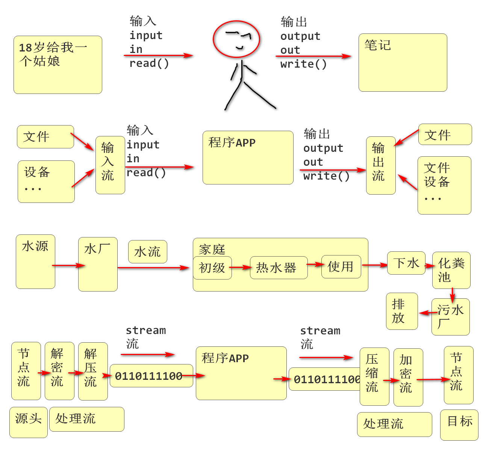
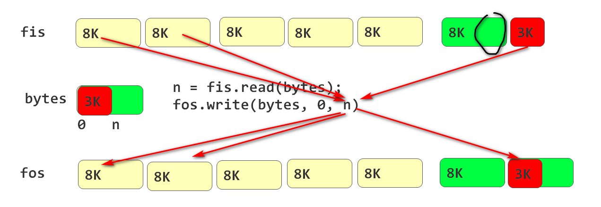
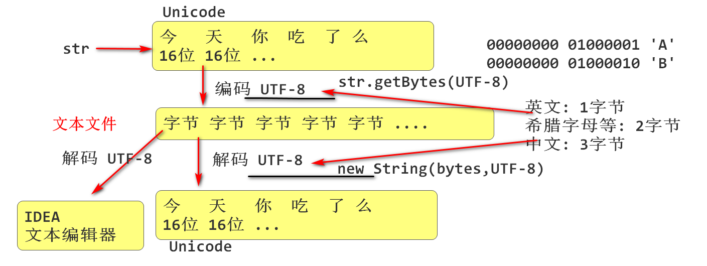
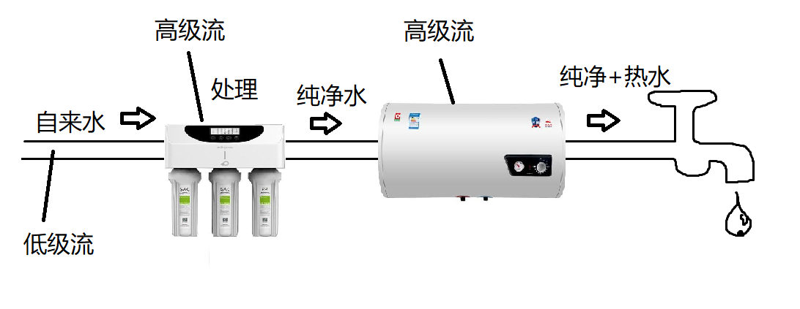

# Java SE 4

## Stream 流

java IO 流, 统一处理各位文件设备的编程模型.

Java IO 流将所有设备抽象为 输入(Input)和输出(Output)

输入: Input 简写为 in, 外部向程序输入数据

输出: Output 简写为 out, 程序向外界输出数据



流的分类:

节点流: 是数据的源头或者数据最终目标

处理流: 对数据进行加工处理, 实现一个功能

## 流的父类型

Java 定义了输入输出流抽象类, 大部分流都继承于这两个类. 方便统一管理.

- InputStream: 输入流, 代表数据流入到应用程序
  - 定义了抽象read方法, 用于读取数据

- OutputStream: 输出流, 代表数据流出应用程序
  - 定义了抽象的write(), 用于输出数据

## 文件流

文件流是节点流, 文件流是数据的源头和数据目标位置

- FileInputStream, 实现了InputStream
  - 实现了read()方法, 用于从文件中读取数据

- FileOutputStream, 实现OutputStream
  - 实现了write()向文件中写数据

写文件

```java
package io;

import java.io.FileOutputStream;
import java.io.IOException;

public class FOSDemo1 {
    public static void main(String[] args) throws IOException {
        /*
         * 文件输出流
         */
        /*
         * 构造器
         * - 必须提供目标文件名, 或者文件对象
         * - 创建文件输出流时候, 如果文件没有就创建新文件
         *   如果文件已经存在, 就覆盖文件(替换原文件)
         * - 如果文件创建失败, 就抛出异常
         * - 刚刚打开的文件指针位置在 0
         */
        FileOutputStream fos = new FileOutputStream("./fos.dat");
        /*
         * write(int) 将数据写到文件中
         * 工作过程:
         * - 将参数int类型的低8位写入到文件中, 文件中保存一个字节信息
         * n = 50+256    00000000 00000000 00000001 00110010
         * write                                    00110010  一个字节
         * - 写入后文件指针自动向后移动, 为下次写字节做准备
         *
         * fso -> 00110010 00110011 00110100 _ _ _ _ _
         *        0        1        2        3        4
         * 文件指针                           ^
         *
         * - 如果文件出现故障, 将出现异常
         */
        int n = 50+256;
        fos.write(n);
        fos.write(51);
        fos.write(52);
        fos.write(-1);
        /*
         * 文件使用完毕, 务必关闭 close()
         */
        fos.close();
    }
}
```

读文件

```java
package io;

import java.io.FileInputStream;
import java.io.FileNotFoundException;
import java.io.IOException;

public class FISDemo02 {
    public static void main(String[] args) throws IOException {
        /*
         * 文件输入流
         */
        /*
         * 构造器
         * - 必须提供文件名参数, 或者文件对象
         * - 如果文件存在, 就打开文件, 如果文件不存在则出现异常
         * - 文件打开后文件指针在0位置
         */
        FileInputStream fis = new FileInputStream("./fos.dat");
        /*
         * 文件读取方法
         * fis ->  00110010 00110011 00110100 _ _ _ _ _
         *         0        1        2        3        4
         * 文件指针                            ^
         *
         * b =     00000000 00000000 00000000 00110010
         * b =     00000000 00000000 00000000 00110011
         * b =     00000000 00000000 00000000 00110100
         * b =     11111111 11111111 11111111 11111111
         * 读取原理 read():
         * - 每次从文件中读取一个字节, 填充到int的低8位返回
         *    正常返回值范围: 0 ~ 255
         * - 自动将文件指针移动到下一个位置, 为下次读取做准备
         * - 当读取到文件末尾时候, 返回-1表示结束
         */
        int b = fis.read(); //50
        System.out.println(b);
        b = fis.read();  //51
        System.out.println(b);
        b = fis.read();  //52
        System.out.println(b);
        b = fis.read();  //-1
        System.out.println(b);
        fis.close();
    }
}
```

追加写文件:

```java
package io;

import java.io.FileNotFoundException;
import java.io.FileOutputStream;
import java.io.IOException;

public class FOSDemo2 {
    public static void main(String[] args) throws IOException {
        /*
         * 追加方式打开文件
         * - 打开文件时候 append 设置为true, 则按追加方式打开文件
         *   如果append设置为false, 则覆盖方式, 文件指针在位置0
         * - 文件指针位置在 文件的末尾处, 如果写数据就会接在原有数据之后.
         *
         * fso -> 00110010 00110011 00110100 11111111 _ _ _ _ _
         *        0        1        2        3        4
         * 文件指针                                    ^
         *
         */
        FileOutputStream fos =
                new FileOutputStream("./fos.dat", true);
        fos.write(66);
        fos.write(67);
        fos.write(68);
        fos.close();

    }
}
```

循环读取文件:

```java
package io;

import java.io.FileInputStream;
import java.io.IOException;

public class FISDemo03 {
    public static void main(String[] args) throws IOException {
        /*
         * 循环读取文件全部字节
         */
        FileInputStream in = new FileInputStream("./fos.dat");
        int b;
        //     (b=-1)
        //      -1 != -1  false
        while((b=in.read())!=-1){ //读取到-1就结束了
            System.out.println(b);//50 51 52 255 66 67 68
        }
        System.out.println(b);
        in.close();
    }
}
```

文件复制:

```java
package io;

import java.io.FileInputStream;
import java.io.FileNotFoundException;
import java.io.FileOutputStream;
import java.io.IOException;

public class CopyDemo01 {
    public static void main(String[] args) throws IOException {
        /*
         * 利用IO流赋值文件
         * 复制原理:
         * - 将原文件打开, 一字节一字节读取数据
         * - 将目标文件打开, 一字节一字节写入数据
         */
        //in 是原始文件
        FileInputStream in=new FileInputStream("./image.jpg");
        //out 是目标新文件
        FileOutputStream out = new FileOutputStream("./image_cp.jpg");
        /*
         * in =  01100111 10111101 11100111 00110001        ________
         *       0        1        2        3        4  ... 90
         * 指针                                              ^
         * b = in.read();
         * int b=00000000 00000000 00000000 10111101
         * out.write(b)
         * out=  01100111 10111101 -------- -------- ---------
         *       0        1        2
         * 指针                    ^
         */
        long t1 = System.currentTimeMillis();
        int b; //用于保存每次读取的一个字节数据
        while ((b = in.read())!=-1){ //读取一个字节
            //不要在循环体中再次调用 read()!!!
            out.write(b); //写出一个字节
        }
        in.close(); //关闭文件夹
        out.close();//关闭文件夹
        long t2 = System.currentTimeMillis();
        System.out.println("复制完毕, 耗时:"+(t2-t1));
    }
}
```

批量读取文件:

```java
package io;

import java.io.FileInputStream;
import java.io.IOException;

public class FISDemo04 {
    public static void main(String[] args) throws IOException {
        /*
         * 批量读取文件
         * 每次将从文件中读取尽可能多的数据填充到 byte数组中
         * 返回读取的字节数据, 如果读取到文件末尾, 返回-1
         */
        FileInputStream in = new FileInputStream("./image.jpg");
        //创建一个内存数组, 也称为内存缓冲区. 大小为 8K
        byte[] bytes = new byte[1024*8];
        int n;
        while ((n = in.read(bytes))!=-1){
            System.out.println(n);
        }
        System.out.println(n);
        in.close();
    }
}
```

缓存版本文件复制:



```java
package io;

import java.io.FileInputStream;
import java.io.FileOutputStream;
import java.io.IOException;

public class CopyDemo02 {
    public static void main(String[] args) throws IOException {
        /*
         * 利用缓冲区复制文件
         */
        FileInputStream in = new FileInputStream("./image.jpg");
        FileOutputStream out = new FileOutputStream("./img.jpg");
        long t1 = System.currentTimeMillis();
        byte[] bytes = new byte[1024*8];
        int n;
        while ((n = in.read(bytes))!=-1){
            out.write(bytes,0,n);
        }
        in.close();
        out.close();
        long t2 = System.currentTimeMillis();
        System.out.println("复制完毕!耗时:"+(t2-t1));
    }
}
```


## 文本文件

一般是 .txt 文件

关于文本文件

- 文件内部存储的都是字节(8位)为单位的数据
- 文字char类型, 是16位整数
- 将文字存储到文件中, 需要进行拆分! 需要将16位整数拆分为8位字节, 然后再存储.
  - 将文字拆分为字节: 称为文字的编码
- 将文本文件中的字节读取在进行合并, 才能得到文字信息
  - 将字节合并为字符: 称为文字的解码



```java
package io;

import java.io.FileInputStream;
import java.io.FileOutputStream;
import java.io.IOException;
import java.io.UnsupportedEncodingException;

public class TextDemo {
    public static void main(String[] args) throws IOException {
        /*
         * 写文本文件
         */
        String str = "万丈高楼平地起,辉煌成功靠自己";
        /*
         * 将字符串按照 "UTF-8" 标准进行编码, 得到编码以后
         * 的字节序列: 英文1字节, 希腊字母2字节, 中文3字节
         */
        byte[] bytes = str.getBytes("UTF-8");
        System.out.println(bytes.length);
        FileOutputStream out=new FileOutputStream("./text.txt");
        //将编码以后的字节数据存储到文件中, 存储文本编码的文件是文本文件
        out.write(bytes);
        out.close();
        //读取文本文件:
        bytes = new byte[2000];
        FileInputStream in = new FileInputStream("./text.txt");
        int n = in.read(bytes);
        System.out.println("读取了字节数:"+n);
        //对读取结果进行解码:
        String s = new String(bytes, 0, n, "UTF-8");
        System.out.println(s);
        in.close();
    }

}
```

文件流是节点流, 只提供最基本的字节读写功能. 低级流. 



### 过滤流

过滤流也就就是高级流, 在其他流基础之上提供高级扩展功能, 但是需要依赖其他流!

### 缓冲流

缓冲流是一个高级流, 在其他流基础之上提供了缓冲区管理功能, 利用缓冲流提供个缓冲区可以大大IO读写性能. 

Buffered: 缓冲的

Buffer: 缓冲 缓存

BufferedInputStream: 在其他输入流基础之上, 提供输入缓冲区, 默认大小8K

BufferedOutputStream:在其他输出流基础之上, 提供输出缓冲区, 默认大小8K

```java
FileInputStream fis = new FileInputStream("./image.jpg");
BufferedInputStream bis=new BufferedInputStream(fis);
bis.read();//读取一个时候, bis先读取一批到缓冲区, 然后返回一个数据
```


```java
FileOutputStream fos = new FileOutputStream("./img.jpg");
BufferedOutputStream bos = new BufferedOutputStream(fos);
bos.write(data);//data先进入bos内部的缓存区, 
bos.write(data);//data先进入bos内部的缓存区,
...
bos.write(data);//缓存区满了, 正好8K的时候, 批量写到文件,
bos.close();//关闭bos时候, bos会把没有写数据, 立即写到文件中
```


```java
package io;

import java.io.*;

public class BufferedDemo {
    public static void main(String[] args) throws IOException {
        /*
         * 缓冲流案例
         * - 在改变IO代码情况下, 可以为程序添加缓冲区, 提升性能
         * - 建议所有文件访问时候, 都有添加缓冲流!
         * - 缓冲流是高级流, 必须依赖其他流
         */
        FileInputStream fis = new FileInputStream("./image.jpg");
        //将缓冲流套在文件输入流的外面, 为文件流扩展了缓冲区. 扩展后不要再使用
        //原有的文件流fis, 要直接使用缓冲流bis
        BufferedInputStream bis = new BufferedInputStream(fis);

        FileOutputStream fos = new FileOutputStream("./img.jpg");
        //在文件输出流外面套接缓冲流, 就是为文件输出流扩展了缓冲区
        BufferedOutputStream bos = new BufferedOutputStream(fos);
        int b;
        while((b = bis.read())!=-1){
            bos.write(b);
        }
        //关闭外部的处理流时候, 处理流就会关闭内部套接的底层流
        bis.close();
        bos.close();
        System.out.println("复制完成!");
    }
}
```