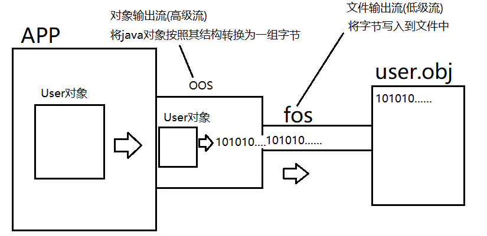
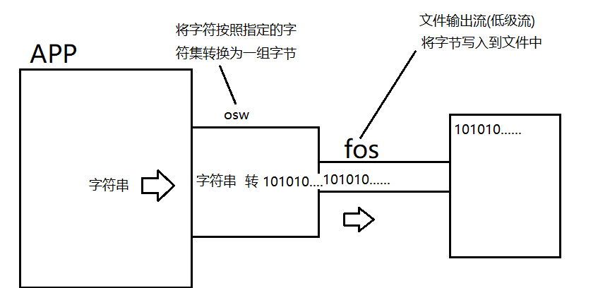
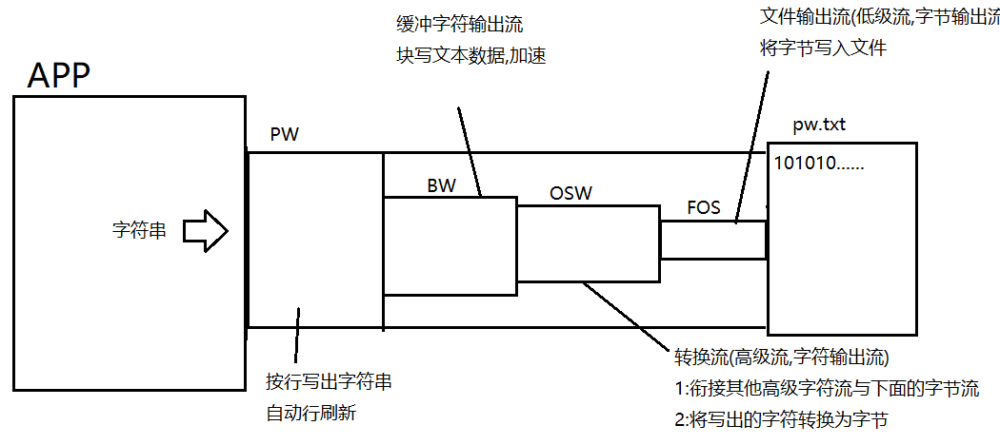

# day05

#### 对象流

java.io.ObjectOutputStream和ObjectInputSteam

对象流是一对高级流，在流连接中的作用是进行对象的序列化与反序列化。

对象序列化:将一个java对象按照其结构转换为一组字节的过程

对象反序列化:将一组字节还原为java对象(前提是这组字节是一个对象序列化得到的字节)

##### 对象序列化的流连接操作原理图:



```java
package io;

import java.io.*;

/**
 * 对象流java.io.ObjectOutputStream和ObjectInputStream
 * 对象流是一对高级流,功能是进行对象的序列化与反序列化.
 * 对象序列化:将一个对象按照其结构转换为一组字节的过程.
 */
public class OOSDemo {
    public static void main(String[] args) throws IOException {
        User user = new User("刘苍松","123456",60,"苍老师");

        FileOutputStream fos = new FileOutputStream("user.obj");
        ObjectOutputStream oos = new ObjectOutputStream(fos);
        /*
         *  User对象---oos--->字节(2进制)---fos--->写入文件中
         *           序列化               持久化
         *
         * 持久化:将数据写入磁盘做长久保存的过程
         *
         *
         * 对象流在进行对象序列化时要求写出的对象必须实现可序列化接口,否则会抛出异常:
         * java.io.NotSerializableException: io.User
         *                                 冒号后面是实际要序列化对象的包名+类名
         *                                 表示该类没有实现序列化接口
         */
        oos.writeObject(user);
        System.out.println("写出完毕!");
        oos.close();
    }
}
```

##### 对象反序列化

```java
package io;

import java.io.FileInputStream;
import java.io.FileNotFoundException;
import java.io.IOException;
import java.io.ObjectInputStream;

/**
 * 对象输入流,进行对象的反序列化
 */
public class OISDemo {
    public static void main(String[] args) throws IOException, ClassNotFoundException {
        //读取user.obj文件,将User对象读取回来
        FileInputStream fis = new FileInputStream("user.obj");
        ObjectInputStream ois = new ObjectInputStream(fis);

        User user = (User)ois.readObject();
        System.out.println(user);
        ois.close();
    }
}
```

```java
package io;

import java.io.Serializable;

/**
 * 使用当前类测试对象流的对象序列化与反序列化操作
 *
 * 只有实现了java.io.Serializable的类才能进行对象序列化与反序列化
 */
public class User implements Serializable {
    private String username;
    private String password;
    private int age;
    //被transient修饰的属性在进行序列化时会被忽略.
    private transient String nickname;

    public User(String username, String password, int age, String nickname) {
        this.username = username;
        this.password = password;
        this.age = age;
        this.nickname = nickname;
    }

    public String getUsername() {
        return username;
    }

    public void setUsername(String username) {
        this.username = username;
    }

    public String getPassword() {
        return password;
    }

    public void setPassword(String password) {
        this.password = password;
    }

    public int getAge() {
        return age;
    }

    public void setAge(int age) {
        this.age = age;
    }

    public String getNickname() {
        return nickname;
    }

    public void setNickname(String nickname) {
        this.nickname = nickname;
    }

    @Override
    public String toString() {
        return "User{" +
                "username='" + username + '\'' +
                ", password='" + password + '\'' +
                ", age=" + age +
                ", nickname='" + nickname + '\'' +
                '}';
    }

}
```

### 字符流

- java将流按照读写单位划分为字节流与字符流.
- java.io.InputStream和OutputStream是所有字节流的超类
- 而java.io.Reader和Writer则是所有字符流的超类,它们和字节流的超类是平级关系.
- Reader和Writer是两个抽象类,里面规定了所有字符流都必须具备的读写字符的相关方法.
- 字符流最小读写单位为字符(char),但是底层实际还是读写字节,只是字符与字节的转换工作由字符流完成.

#### 转换流

java.io.InputStreamReader和OutputStreamWriter

它们是字符流非常常用的一对实现类同时也是一对高级流,实际开发中我们不直接操作它们,但是它们在流连接中是非常重要的一环.



```java
package io;

import java.io.*;

/**
 * 字符流
 * java将IO中的流按照读写数据的单位划分为字节流与字符流
 * 字节流的超类:java.io.InputStream和OutputStream
 * 字符流的超类:java.io.Reader和Writer
 * 字符流是以字符(char)为最小单位读写数据的,因此字符流仅适合读写文本数据.
 *
 *
 * 转换流
 * java.io.InputStreamReader和OutputStreamWriter
 * 它们是常用的字符流实现类,实际开发中我们通常不会直接操作这两个流,但是在流连接中它们是重要
 * 的一环.
 *
 */
public class OSWDemo {
    public static void main(String[] args) throws IOException {

        FileOutputStream fos = new FileOutputStream("osw.txt");
        //第二个参数为字符集,通过当前字符流写出的字符都会按照该字符集转换为字节
        OutputStreamWriter osw = new OutputStreamWriter(fos,"UTF-8");

        String str = "苍老师:吃个桃桃~";
        osw.write(str);
        osw.write("嗯~~好凉凉~");

        System.out.println("写出完毕!");
        osw.close();


    }
}
```

##### 读取文本数据

```java
package io;

import java.io.*;

/**
 * 使用转换流读取文本数据
 */
public class ISRDemo {
    public static void main(String[] args) throws IOException {
        FileInputStream fis = new FileInputStream("osw.txt");
        InputStreamReader isr = new InputStreamReader(fis,"UTF-8");
        /*
            字符输入流也提供了read方法用于读取字符.
            int read()
            读取一个字符,并以int型返回,若返回的int值为-1则表示读取到了末尾.
         */
        int d;
        while((d = isr.read()) != -1) {
            char c = (char) d;
            System.out.print(c);
        }
        isr.close();

    }
}
```

##### 转换流的意义:

实际开发中我们还有功能更好用的字符高级流.但是其他的字符高级流都有一个共通点:不能直接连接在字节流上.而实际操作设备的流都是低级流同时也都是字节流.因此不能直接在流连接中串联起来.转换流是一对可以连接在字节流上的字符流,其他的高级字符流可以连接在转换流上.在流连接中起到"转换器"的作用(负责字符与字节的实际转换)


#### 缓冲字符流

##### 缓冲字符输出流:java.io.PrintWriter

java.io.BufferedWriter和BufferedReader

缓冲字符流内部也有一个缓冲区,读写文本数据以块读写形式加快效率.并且缓冲流有一个特别的功能:可以按行读写文本数据.

java.io.PrintWriter具有自动行刷新的缓冲字符输出流,实际开发中更常用.它内部总是会自动连接BufferedWriter作为块写加速使用.



```java
package io;

import java.io.FileNotFoundException;
import java.io.PrintWriter;

/**
 * 缓冲字符流
 * java.io.BufferedWriter和BufferedReader
 * 缓冲字符流内部也有一个数组用于块读写文本数据来提高读写效率
 *
 * java.io.PrintWriter具有自动行刷新的缓冲字符输出流并且可以按行写出字符串,其内部总是
 * 连接这BufferedWriter作为缓冲加速
 */
public class PWDemo {
    public static void main(String[] args) throws FileNotFoundException {
        /*
            提供了对文件写操作的构造方法
            PrintWriter(File file)
            PrintWriter(String filename)
         */
        //对文件pw.txt写操作
        PrintWriter pw = new PrintWriter("pw.txt");

        pw.println("万丈高楼平地起,辉煌只能靠自己~");
        pw.println("社会很单纯,复杂滴是人~");
        pw.println("嘿~巴扎黑~");
        System.out.println("写出完毕!");
        pw.close();

    }
}
```

##### 在流链接中使用PW

```java
package io;

import java.io.*;

public class PWDemo2 {
    public static void main(String[] args) throws FileNotFoundException, UnsupportedEncodingException {
        //低级流,负责将字节写入文件
        FileOutputStream fos = new FileOutputStream("pw.txt");
        //负责衔接其他字符流与字节流
        OutputStreamWriter osw = new OutputStreamWriter(fos,"UTF-8");
        //负责块写文本数据加速
        BufferedWriter bw = new BufferedWriter(osw);
        //负责按行写出字符串,自动行刷新
        PrintWriter pw = new PrintWriter(bw);
        /*
            上述流连接后,pw.println("你好")的写出过程:
            "你好"---pw--->"你好\n"---bw--->加速写---osw--->字节---fos--->写入文件
                   按行写          缓冲加速       字符转字节      写入文件
         */
        pw.println("你好");
        pw.println("再见!");

        pw.close();
    }
}
```

##### PrintWriter的自动行刷新功能

如果实例化PW时第一个参数传入的是一个流，则此时可以再传入一个boolean型的参数，此值为true时就打开了自动行刷新功能。 即: 每当我们用PW的println方法写出一行字符串后会自动flush.

